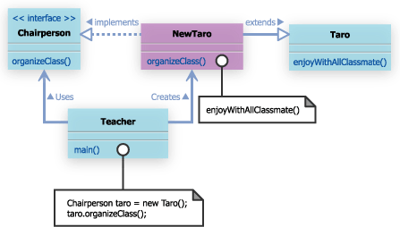
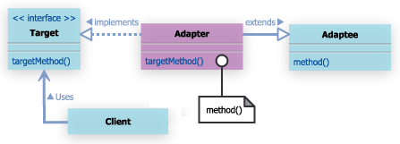
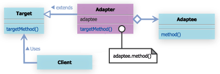

#2. Adapterパターン

##2.1 Adapterパターンとは

- adaptとは適合させるという意味
- Adapterパターンは、インタフェイスに互換性の無いクラス同士を組み合わせることを目的としたパターン。

- 例えば、これまで利用していたメソッドと同じ機能を、より優れた形で提供するメソッドを持つクラスの存在を知ったとする

	- しかし、この優れたメソッドは、これまで医療していたメソッドとは異なるインタフェイスを持つため、乗り換えると多大な変更を余儀なくされる場合がある。
	- こんなとき、この２つのメソッドのインタフェイスの違いを吸収してやるAdapterを準備することで、少ない変更で新しいメソッドに乗り換えることができる。
	- このような目的を果たすためAdapeterパターンでは、2つの方法を与えている。
		- 継承を利用した方法
		- 移譲を利用した方法
		
##2.2 サンプルケース1 (継承を利用したAdapterパターン)
あなたは、相変わらず学校の先生をしている。

class Taro

```
public class Taro{
	public void enjoyWithClassmate(){
		System.out.println("みんなで楽しむ");
	}
}
```

interface Chairperson

```
public interface Chairperson{
	 public void organizeClass();
}
```

class Teacher

```
public class Teacher{
	 public static void main(String args[]){
	 	Chairperson chairperson = new Taro();
	 	chairperson.organizeClass();
	 }
}
```





###実習課題１
TaroクラスとChairpersonインタフェイスのインタフェイスの違いを埋めるようにNewTaroクラスを実装せよ。
Teacherクラスのmainメソッドの中身を変更することは問題ない。

- 継承をもちいたAdapterパターンの一般的なクラス図

  


##2.3 サンプルケース２(移譲を利用したAdapterパターン)

- 何らかの慰留で継承を利用したAdapterパターンが利用できないことも考えられる
	- 例えば、Targetがインターフェイスではなく、抽象クラスとして宣言されている場合。
		- この場合、Adapterクラスは、Targetクラスをimplementsすることができないため、extendsする必要が出てくる。
		- Target抽象クラスとAdapteeクラスの両方を継承する必要が出てきてしまう。
			- これは、多重継承を禁じているJavaの場合、くそ引っかかるよね

このような場合は、以上を利用したAdapterパターンを利用してみる。

- 移譲を利用するAdapterパターンのクラス図			




###実習課題２

太郎がどうしてもChairpersonインターフェイスを実装したくないと言いはった場合のことを考える。
hanakoにchairpersonインタフェイスを実装してもらう。

```
package com.bko.adapter;

/**
 * Created by yo on 4/3/15.
 */
public class Hanako implements Chairperson {
    private Taro taro;

    public Hanako() {
        this.taro = new Taro();
    }

    @Override
    public void organaizeClass() {
        this.taro.enjoyWithClassmate();
    }
}

```


###2.4 Adapterパターンまとめ
Adapterパターンは、利用したいインタフェイスを強制的に変えたいような場合に利用するとよい。


