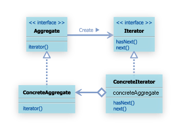

##1.1Itaratorパターンとは

まずは、デザインパターンになれるために比較的理解しやすいItaratorパターンを学ぶ。

集約オブジェクトとしてListクラスを想定する。
Listクラスは、要素としていくつかのオブジェクトを持つことができるとする。

このListオブジェクトが持つ要素に順番にアクセスするような場合、どのような順番で各要素にアクセスするのかによって、様々な操作方法が考えられる。

例えば、
- 各オブジェクトが持つ名前の順番にアクセスしたい場合が考えられる
- 各オブジェクトの何らかのパラメータを利用して操作したい場合もある

これらの「操作方法」は誰が提供すれば良いのだろうか。
LIstクラスで全ての操作方法を提供することは不可能である。
なぜなら、操作方法は、その目的によって、様々なものが考えられ、その全てを予め用意しておくことができないから。

*そこで、この操作方法を与えるクラスをListクラスとは独立させておく。*
すると、必要な操作方法を与えるクラスをユーザが自分で作成、これを利用できるようになり、より柔軟な設計となる。

また、集約オブジェクトとして利用するクラスを変更する必要が生じた際などに、その変更が多くの部分に影響を与えるようなことが考えられる。
Iteratorパターンでは、集約オブジェクトを生成するクラスが操作のための共通のインターフェイスを与えるようにすることで、変更すべき点を少なく抑える設計になる。


##1.2サンプルケース
サンプルケースとして、先生と生徒を考える。
担任している「生徒」は五人いるとする。

class student

```  
public class Student{
	private String name;
	private int sex; //male 1, female 2
	
	public Student(String name,int sex){
		this.name = name;
		this.sex = sex;
	}
	
	public String getNamae(){
		return name;
	}	
	
	public int getSex(){
		return sex;
	}
}


```

生徒は名前、性別を表すメンバ変数 name 、sexを持ち、名前を返す getName() メソッドと、性別を返す getSex() メソッドを持ちます。 これらの生徒を管理するために学校から先生に名簿が支給されます。学校から与えられる名簿は以下のように記述されている。

[javaの修飾子_pic](../assets/img/decorator_on_java.jpg)
[javaの修飾子_web](http://www.tohoho-web.com/java/modifier.htm)

	protected -> 他ファイルの他クラスから参照できない。
	自ファイル内はどこからでも参照可能。サブクラスはどこからでも参照可能。
	前提としてスコープの広い順に、
		public > protected > 修飾子なし > private
	
[オーバーライドとオーバーロード](http://www.javaroad.jp/java_class8.htm)

class StudentList


```
public class StudentList{
    protected Student[] students;
    private int last = 0;

    pubilc StudentList(){} //コンストラクタ
    public StudentList(int studentCount){ //オーバーロード
        this.students = new Student[studentCount];
    }

    //リストの最後に、新しくStudentを追加する。(push)
    public void add(Student student){
        students[last] = student;
        last++;
    }

    public StudentgetStudentAt(int index){
        return students[index];
    }

    public int getLastNum(){
        return last;
    }
}


```

あなたは、学校から支給されたこの```StudentList```クラスを自由に拡張して利用することができるとする。

学校の先生はこうあるべき、というアレとして、
第一条 先生は、学校から与えられた名簿に自分の生徒の名前を書き込むことができるｋと
第二条 先生は、生徒の名前を名簿の記載順に呼ぶことができること

[abstract class](http://www.javaroad.jp/java_class13.htm)として、こう表現される

abstract class Teacher

```
public abstract class Teacher{
    protected StudentList studentList;

    public abstract void createStudentLIst();
    public abstract void callStudents();
}
```


---

###抽象クラス,抽象メソッドとは
抽象クラスは、そのクラス自身のオブジェクトを生成することはできない。
通常抽象クラスは実装のないいくつかの抽象メソッドを持っている。
抽象クラスをサブクラスで継承し、そのサブクラス内で抽象クラスで実装されていない抽象メソッドを実装(オーバーライド)し、オブジェクトを生成する形をとる。

*抽象クラスは共通の昨日を表現し、個々が持つ独自の昨日はそれぞれのサブクラスで実装したい場合に仕様する。*
たとえば、自動車 といったクラスがあるとして、座席、ウィンドウをｔ行った車種によって異なる昨日を全て「自動車」クラスの中で実装することは困難である。
そこで共通の機能のみを「自動車」クラスの中で実装し、「自動車」クラスを抽象クラスとして宣言する。
そして、エンジン、ブレーキと言った個々の機能は「自動車」抽象クラスを継承したサブクラス(例えば、ベンツやら、フェラーリやら)の中で実装する。

###抽象クラスとインターフェイスの違い
メソッドのヘッダーのみ宣言し、実装を継承したサブクラスに任せる(インタフェイスの場合はインプリメントしたクラスに任せる)といったことを考えると抽象クラスとインターフェイスは似た役割を果たす。


しかし両者には大きな違いがある。

1. 抽象クラスには抽象メソッドと抽象でないメソッドの両方を宣言することができるが、インタフェイスは抽象メソッドのみしか宣言することができない。
2. サブクラスで継承できる抽象クラスはJavaは多重継承をサポートしていないため、一つのみである。インプリメントするインターフェイスは複数インプリメントすることができる。
3. 抽象クラスの機能を利用するためには抽象クラスを継承する必要がある。
そのため、その機能は継承関係内に限られる。インタフェイスは、インプリメントにより利用することができる。そのため、その機能が継承関係に限定されることはない。

[インターフェイス](http://msugai.fc2web.com/java/interface.html)

---


#実習課題

###実習課題1
「Teacher」抽象クラスを継承するMyTeacherクラスと、「StudentLIst」クラスを拡張したMyStudentListクラスを設計し、クラス図を作成する。

また、これらのクラスを実装し、下記のMainクラスを実行する。


class Main

```
public class Main{
	public static void main(String args[]){
		Teacher you = new MyTeacher();
		
		you.createStudentList();
		you.callStudent();
	}
}

```

###実装

```

package com.bko.iterator.study1;

import com.bko.iterator.samples.Teacher;
import com.bko.iterator.samples.StudentList;
import com.bko.iterator.samples.Student;

/*
spec
student names
赤井亮太　男
赤羽里美　女
岡田美央　女
西森俊介　男
中ノ森玲菜　女

 */
public class MyTeacher extends Teacher{
    protected StudentList studentList;

    @Override
    public void createStudentList() {
        String[] studentsNameList = {
                "赤井亮太",
                "赤羽里美",
                "岡田美央",
                "西森俊介",
                "中ノ森玲菜"
        };

        int[] studentSexList = { 1, 2, 3, 1, 2 };

        if(studentList == null) {
            studentList = new StudentList(studentsNameList.length);
        }

        for(int i = 0; i < studentsNameList.length; i++) {
            Student student = new Student( studentsNameList[i], studentSexList[i] );
            studentList.add( student );
        }

    }

    @Override
    public void callStudents() {
        for(int i = 0; i < studentList.getLastNum(); i++ ){
            System.out.println( studentList.getStudentAt(i).getName() );
        }
    }
}

```

- ここからがIteratorパターンの本筋。

	学校から、「名簿が古く鳴ったので、新しい形式のものに変えようと思う。新しい名簿は、java.util.Vectorクラスを利用したものです。」との通達があり、新しい名簿が渡されたとする。
	


```
import java.util.Vector;
 
public class NewStudentList{
    protected Vector<Student> students;
    public void add(Student student){
        students.add(student);
    }
    public Student getStudentAd(int index){
        return students.get(index);
    }
}


```


**Iteratorパターン**




	Iteratorパターンでは、何らかの集約体が必ずAggregateインターフェイスを実装するようにしている。	
	Aggregate とは、集約の意味で
	Aggregate インタフェイスでは、Iteratorインタフェイスの実装クラスを返す、Iterator()というメソッドを定義しているだけ。
	Iteratorインタフェイスでは、集約体を操作するために必要なメソッドとして、
	この集約体に次の要素が存在するかしないかをboolean型で返す hasNext() メソッドと、
	次の要素を返すnext()メソッドを定義する。
	next()メソッドの帰り値は、Object型とする。
	この２つのインタフェイスのコードはこんな感じ
	

interface Aggregate

```
public interface Aggregate{
	public Iterator iterator();
}

```

interface Iterator

```
public interface Iterator{
	public boolean hasNext();
	public Object next();
}
```

より具体的に、
今回のケースだと
- 具体的な集約体を表すクラスはどのクラスになるか
	- StudentList
	- これを拡張したクラスとして、MyStudent クラスを作成する
	こいつが、*Aggregate*インターフェイスを実装する必要がある
	
	
```
public class MyStudentList extends StudentList implements Aggregate{
    public Iterator iterator(){
        return ・・・; //Iteratorオブジェクトを返す。
        }
}

```


