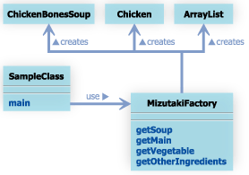
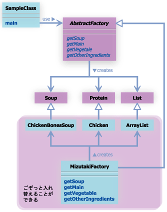
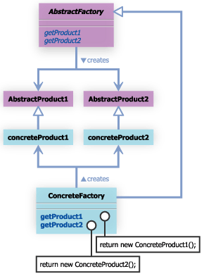

#AbstractFactoryパターン

## 8.1 AbstractFactoryパターンとは

- 抽象的な工場
- AbstractFactoryパターンとは、インスタンスの生成を専門に行うクラスを用意することで、整合性を必要とされる一連のオブジェクト群を間違いなく生成するためのパターン。

- アブストラクトファクトリは、関連するオブジェクト群を、具象クラスを明確にせず生成するためのパターン。
- GUI部品の生成でこのパターンがよく使われる。
- GUIの部品は、ダイアログやボタン、スクロールバーなど様々な種類があり、WindowsやUnixなどの環境によって表示や動作が違う。

- このようなGUI部品を利用したアプリケーションで、別のOSのGUI部品にすぐに切り替えられるようにするためには、クライアントを特定のGUI部品に依存させず、GUI部品群の生成を一箇所にまとめる必要がある。


- 例えば、「車」を作成するプログラムを考えてみる。このプログラムのある部分で、「車」オブジェクトである変数carにタイヤとハンドルを追加している。


```
car.addTire(new carTiere());
car.addHandle(new CarHandle());
```

 このプログラムの書き方は、たいていの場合問題ないが、プログラマのふとしたミスで、とんでもない間違いが起きる可能性がある。
 
 例えば、車を作っているのに、自転車のタイヤをわたしてしまうようなことをが考えてみたらどうか
 
 ```
car.addTire(new BicycleTire());
 
car.addHandle(new CarHandle());

 ```
 
 利用すべきでないオブジェクトを利用してしまう可能性は大いに考えられる。
 
 こののようなとき、車を作成するために必要な一連のオブジェクトを作成することを一手に引き受ける工場クラスを用意し、
 タイヤやハンドルと言ったオブジェクトを生成するときは、この工場クラスを利用してオブジェクトの生成を行うようにすることで、先ほどのような間違いが起こることを回避することができる。
 また、この工場クラスを変更することで、利用する一連のオブジェクトをごっそり変更することもできるようになる。
 
 
 
## 8.2 サンプルケース
サンプルケースでは、「鍋」を作ることを考えて見ます。水炊き、すき焼き、キムチ鍋、ちゃんこ鍋、石狩鍋、様々な鍋が考えられますが、おおよそ以下のパーツからなっていると考えられます。

スープ
メインの具(たんぱく質)
野菜
その他の具
メインの具とは、肉や魚などのたんぱく質を指すものとします。鍋物をあらわす HotPot クラスは以下のように定義されているものとします。


```
package com.bko.generate_patterns.abstract_factory;

import java.util.*;
/**
 * Created by bko on 4/6/15.
 */
public class HotPot {
    private Pot pot;
    private Soup soup;
    private Protein protein;
    private List vegetables;
    private List otherIngredients;

    public HotPot(Pot pot){
        this.pot = pot;
    }

    public addSoup(Soup soup){
        this.soup = soup;
    }

    public void addMain(Protein protein){
        this.protein = protein;
    }

    public void addVegetables(list<Vegetable> vegetables){
        this.vegetables = vegetables;
    }

    public void addOtherIngredients(List<Ingredients> otherIngredients){
        this.otherIngredients = otherIngredients;
    }
}

```

コンストラクタの引数で、利用する鍋(容器として)を指定します。addSoup メソッドは、引数に Soup を取り、利用するスープを追加するものです。Soup クラスはここでは定義しませんが、スープをあらわすクラス全般の親クラスになるものと考えてください。次に、addMain メソッドですが、これは、引数に Protein オブジェクトを取ります。Protein クラスもここでは定義しませんが、Chicken や Beef 、Tofu クラスなどの親クラスになるものと考えてください。addVegitables メソッドは、引数に List を取り、「野菜」を追加するためのメソッドです。addOtherIngredients メソッドは、引数に List を取り、「その他の具」を追加するためのメソッドです。[ジェネリクス](http://d.hatena.ne.jp/Nagise/20101105/1288938415)で指定しているIngredientsクラスは、具のスーパークラス（Proteinクラス、Vegetableクラスのスーパークラス）と思ってください。

- まずは、水炊きを作ってみましょう

```
import java.util.*;
 
public class SampleClass{
    public static void main(String args[]){
        HotPot hotPot = new HotPot(new Pot());
        hotPot.addSoup(new ChickenBonesSoup()); // 鶏がらを煮込んだスープ
        hotPot.addMain(new Chicken());        // Main として鶏肉
        List<Vegetable> vegetables = new ArrayList<Vegetable>();
        vegetables.add(new ChineseCabbage()); // 白菜
        vegetables.add(new Leek());           // ねぎ
        vegetables.add(new Chrysanthemum());  // 春菊
        hotPot.addVegetables(vegetables);
        List<Ingredients> otherIngredients = new ArrayList<Ingredients>();
        otherIngredients.add(new Tofu());     // 豆腐
        hotPot.addOtherIngredients(otherIngredients);
    }
}
```

これで水炊きの完成！

- しかし、このようなプログラミング方法では、プログラマによって、様々な水炊きが作成される。これを防ぎたい場合がある。

- このような場合に、水炊きの具となるオブジェクトを専門に生成するクラスを用意し、水炊きを作るときにこのクラスからオブジェクトの生成を行うようにする。

このクラスを、MizutakiFactoryというクラスにしようか。


```
import java.util.*;
 
public class MizutakiFactory extends Factory{
    public Soup getSoup(){
        return new ChickenBonesSoup();
    }
    public Protein getMain(){
        return new Chicken();
    }
    public List<Vegetable> getVegetables(){
        List<Vegetable> vegetables = new ArrayList<Vegetable>();
        vegetables.add(new ChineseCabbage());
        vegetables.add(new Leek());
        vegetables.add(new Chrysanthemum());
        return vegetables;
    }
    public List<Ingredients> getOtherIngredients(){
        List<Ingredients> otherIngredients = new ArrayList<Ingredients>();
        otherIngredients.add(new Tofu());
        return otherIngredients;
    }
}

```


これにあわせて、SampleClassクラスはこんなかんじになる
```
import java.util.*;
 
public class SampleClass{
    public static void main(String args[]){
        HotPot hotPot = new HotPot(new Pot());
        Factory factory = new MizutakiFactory();
        hotPot.addSoup(factory.getSoup());
        hotPot.addMain(factory.getMain());
        hotPot.addVegetables(factory.getVegetables());
        hotPot.addOtherIngredients(factory.getOtherIngredients());
    }
}
```

水炊きを生成するときには、必ずこのMizutakiFactoryクラスを利用するようにすることによって、プログラマによらずいつも同じ水炊きを生成することができるようになる。

すなわち、プログラマが過ちをおかしにくい構図になる。



この段階ではまだ AbstractFactory パターンとはなっていませんが、「利用するオブジェクトの整合性を保ちたい」という要求には応えることができます。

MizutakiFactory と同じように、SukiyakiFactory、KimuchiFactoryなどを作成することが考えられますので、これらのクラスの親クラスとして Factory クラスを作成しておきます。Factory クラスは、以下のように、getSoup、getMain、getVegetables、getOtherIngredients の４つの抽象メソッドを定義しています。

factory
```
import java.util.*;
 
public abstract class Factory{
    public abstract Soup getSoup();
    public abstract Protein getMain();
    public abstract List getVegetables();
    public abstract List getOtherIngredients();
}
```

main メソッドの中では、Factory メソッドの実際の型を知ることなく処理が進んでいます。すなわち、抽象的な Factory クラスを利用して処理を進めていっているのです。このようにすることで、「利用するオブジェクト群をごそっと入れ替える」という要求に応えることができるようになりました。この状態のクラス図を確認してみます。




## 8.2 AbstractFactoryパターンまとめ

サンプルケースの SampleClass の main メソッドのように、実際にどの Factory サブクラスが利用されるのかは、明確にはされていない状態で、鍋に利用するオブジェクト群を得ています。

AbstractFactory パターンの一般的なクラス図は以下のようになります。




