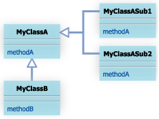
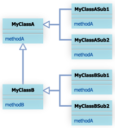
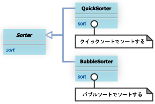
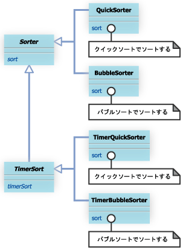

#9 Bridgeパターン

##9.1 Bridgeパターンとは

例えば、ある methodA というメソッドを持つクラス MyClassA は、methodA メソッドの実装が異なる MyClassASub1、MyClassASub2 という２つのクラスによって継承されているとします。このとき、MyClassA にmethodB というメソッドを追加するために、MyClassB クラスという MyClassA を継承するクラスを作成したことを考えてください。



このとき、MyClassB でも、MyClassASub1、MyClassASub2 で実装している methodA と同じ実装を利用したい場合、MyClassB クラスを継承する MyClassBSub1、MyClassBSub2 といったクラスを作成する必要があります



今回のように、２つのクラスだけなら手間はそんなにかかりませんが、場合によっては、MyClassA に機能を追加するためのサブクラス MyClassX を作成するたびに、何十という MyClassXSub・・・　というサブクラスを作成することが必要となります。Bridge パターンは、機能を拡張するための階層と実装を拡張するための階層を分離することにより、このようなわずらわしさを解消し、拡張を容易にするものです。


## 9.2 サンプルケース

サンプルケースでは、ソート機能を持つ抽象クラスSorterと、このSorterクラスで定義されている抽象メソッドだるsort(Object obj[])メソッドを実装するクラス
QuickSorterクラス、BubbleSorterクラスについて考えてみよう


abstract class Sorter
```
package com.bko.structure_patterns.bridge.sorters;

/**
 * Created by bko on 4/6/15.
 */
public abstract class Sorter {
    public abstract void sort(Object obj[]);
}

```

class QuickSorter
```
public class QuickSorter extends Sorter{
    public void sort(Object obj[]){
        // クイックソートで obj[] をソートする
        　・・・・
    }
}
```
class BubbleSorter
```
public class BubbleSorter extends Sorter{
    public void sort(Object obj[]){
        // バブルソートで obj[] をソートする
        ・・・・
    }
}
```

この状態のクラス図


さて、ここで、Sorterクラスにソートにかかった時間を表示する機能をもつtimerSorterメソッドを追加したくなったとする。
そこで、Sorterクラスを拡張するTimerSorterクラスを作成した。

```
public abstract class TimerSorter extends Sorter{
    public void timerSorter(Object obj[]){
        long start = System.currentTimeMillis();
        sort(obj);
        long end = System.currentTimeMillis();
        System.out.println("time:"+(end - start));
    }
}
```

このような場合、糞めんどくさいよね

TimerSorterクラスには
sortの実装を与えられないから。

せっかくQuickSorterクラスやらBubbleSortrerクラスが存在しているにも関わらず、
同様の実装を与えるために、TimerSorterクラスを拡張するTimerQuickSorterクラスやらTimerBubbleSorterクラスを作成する必要がある。

このときのクラス図


[ソートアルゴリズムについて](./sort.md)