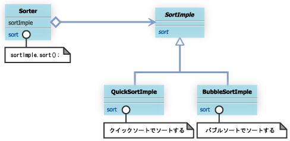
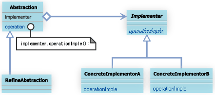

#9 Bridgeパターン

##9.1 Bridgeパターンとは

例えば、ある methodA というメソッドを持つクラス MyClassA は、methodA メソッドの実装が異なる MyClassASub1、MyClassASub2 という２つのクラスによって継承されているとします。このとき、MyClassA にmethodB というメソッドを追加するために、MyClassB クラスという MyClassA を継承するクラスを作成したことを考えてください。


このとき、MyClassB でも、MyClassASub1、MyClassASub2 で実装している methodA と同じ実装を利用したい場合、MyClassB クラスを継承する MyClassBSub1、MyClassBSub2 といったクラスを作成する必要があります


今回のように、２つのクラスだけなら手間はそんなにかかりませんが、場合によっては、MyClassA に機能を追加するためのサブクラス MyClassX を作成するたびに、何十という MyClassXSub・・・　というサブクラスを作成することが必要となります。Bridge パターンは、機能を拡張するための階層と実装を拡張するための階層を分離することにより、このようなわずらわしさを解消し、拡張を容易にするものです。


## 9.2 サンプルケース

サンプルケースでは、ソート機能を持つ抽象クラスSorterと、このSorterクラスで定義されている抽象メソッドだるsort(Object obj[])メソッドを実装するクラス
QuickSorterクラス、BubbleSorterクラスについて考えてみよう


abstract class Sorter
```
package com.bko.structure_patterns.bridge.sorters;

/**
 * Created by bko on 4/6/15.
 */
public abstract class Sorter {
    public abstract void sort(Object obj[]);
}

```

class QuickSorter
```
public class QuickSorter extends Sorter{
    public void sort(Object obj[]){
        // クイックソートで obj[] をソートする
        　・・・・
    }
}
```
class BubbleSorter
```
public class BubbleSorter extends Sorter{
    public void sort(Object obj[]){
        // バブルソートで obj[] をソートする
        ・・・・
    }
}
```

この状態のクラス図


さて、ここで、Sorterクラスにソートにかかった時間を表示する機能をもつtimerSorterメソッドを追加したくなったとする。
そこで、Sorterクラスを拡張するTimerSorterクラスを作成した。

```
public abstract class TimerSorter extends Sorter{
    public void timerSorter(Object obj[]){
        long start = System.currentTimeMillis();
        sort(obj);
        long end = System.currentTimeMillis();
        System.out.println("time:"+(end - start));
    }
}
```

このような場合、糞めんどくさいよね

TimerSorterクラスには
sortの実装を与えられないから。

せっかくQuickSorterクラスやらBubbleSortrerクラスが存在しているにも関わらず、
同様の実装を与えるために、TimerSorterクラスを拡張するTimerQuickSorterクラスやらTimerBubbleSorterクラスを作成する必要がある。

このときのクラス図


[ソートアルゴリズムについて](./sort.md)

- このような問題を回避するためのパターンとしてBridgeパターンはりようされる。
- Bridgeパターンでは、実装の変更が考えられるメソッドに関しては、実装用クラス階層に委譲するように設計する。
- 実装用のクラス階層とは、ここではsortメソッドの実装を与えるクラス階層として、SortImpleクラスを親とするクラス階層をかんがえる。
- 具体的には、Sorterクラス、SortImpleクラスを以下のようなコーディングにしておく。

public class Sorter
```
package com.bko.structure_patterns.bridge.sorters;


/**
 * Created by bko on 4/6/15.
 */
public abstract class Sorter {
    private SortImple sortImple;
    public Sorter(SortImple sortImple){
        this.sortImple = sortImple;
    }
}
```

sortImple
```
package com.bko.structure_patterns.bridge.sorters;

import java.util.Objects;

/**
 * Created by bko on 4/6/15.
 */
public abstract class SortImple {
    public abstract void sort(Object obj[]);
}
```

そして実際にソートの機能を実装するQuickSorter,BubbleSorterをSortImpleのextendとして実装する。

この状態でのクラス図


- このような設計にしておくと、機能を追加するために、Sorterクラスを拡張して作成した新しいクラスでも、すでに存在する実装部分を利用することができるようになる。
- 例えば、Sorterクラスを拡張するTimerSorterクラスを作成する場合には、以下のようなコーディングになる。


```
ublic class TimerSorter extends Sorter{
    public TimerSorter(SortImple sortImple){
        super(sortImple);
    }
    public void timerSort(Object obj[]){
        long start = System.currentTimeMillis();
        sort(obj);
        long end = System.currentTimeMillis();
        System.out.println("time:"+(end - start));
    }
}
```

*このように、機能を拡張するためのクラス階層と、実装を拡張するためのクラス階層を分けておくことで、実装階層クラスと機能拡張クラスを好みの組み合わせで利用することができるようになる。今回の例では、SorteクラスとSortImpleクラスが機能拡張クラス階層と実装拡張クラス階層を橋渡しする役目を果たしている。*




