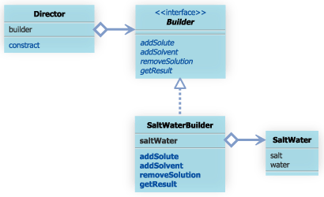
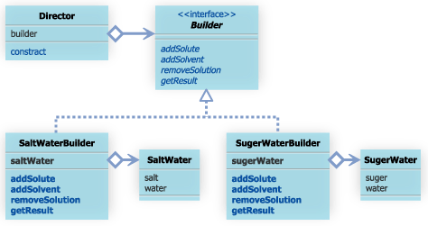
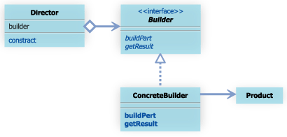

#7.Builderパターン


7.1 Builderパターンとは

- Builderパターンとは、同じ製作過程で異なる表現形式の結果を得るためのパターンです。

- 家を建てることを考える。

- 完成する家がどのような家になるかというのは、「家の構築過程」と「素材」大きく２つの要素で決定されると考える。


##7.2 サンプルケース
サンプルケースでは、理科の実験で、食塩水と砂糖水を作ることを考える。
食塩水を表すクラスは以下のコードで与えられるとする

```
publiv class SaltWater{
	public double salt;
	public double water;
	pulic SaltWater(double water, double salt){
		this.salt = salt;
		this.water = water;
	}
}

```

食塩水を作るのなんて簡単とおもうでしょ
しかし侮ってはいけない。
余計なことをいろいろしながら作る必要があるばあいもあるかもしれない。
例えばこんな数学の問題。

	■問題１■
  	100g の水に 40g の食塩を溶かして作成した食塩水のうち 70g を捨てた後、
	水を 100g 追加し、最後に食塩を 15g 溶かすと 何% になるでしょう?　
	
上記のような食塩水オブジェクトのインスタンスを生成するためには、以下のようにする。

```
SaltWater saltWater = new SaltWater( 100 , 40 );
double saltDelta = 70 * (saltWater.salt / (saltWater.salt + saltWater.water));
double waterDelta = 70 * (saltWater.water / (saltWater.salt + saltWater.water));
saltWater.salt -= saltDelta;
saltWater.water -= waterDelta;
saltWater.water += 100;
saltWater.salt += 15;
```

たいていの場合、このような方法で解決されるだろう。
しかし、場合によっては、もっと柔軟に食塩水オブジェクトを得たいと思うことがあるかもしれない。


しかし、場合によっては、もっと柔軟に食塩水オブジェクトを得たいと思うことがあるかもしれない。
様々な要求が考えられるが、Builderパターンを利用することで、以下の様な要求に答えることができるようになる。

- 同様の作成過程で得られる溶液を何度も利用したい。
- 同じ方法で砂糖水を作成したい。

このような要求にこたえるため、Builderパターンでは、DirectorとBuilderとなるクラスを作成する。
一節でも行っていたように、

- Directorの役割は、「作成過程」を決定すること
- Builderの役割は、「表現形式」を決定すること。

サンプルケースにおいては、Directorの役割は、 Director の役割は、「100g の溶媒に 40g の溶質を溶かし、うち 70g を捨てた後、溶媒を 100g 追加し、最後に溶質を 15g 加える」ということを決定することです。また、Builder の役割は、「溶媒に水、溶質に食塩」を使うことを決定することです。クラス図にすると、以下のようになります。



Builder インタフェイス

```
package com.bko.generate_patterns.builder;

/**
 * Created by bko on 4/6/15.
 */
public interface Builder {
    public void addSolute(double soluteAmount);
    public void addSolvent(double solventAmount);
    public void abandonSolution(double solutionAmount);
    public Object getResult();
}

```

Builderインタフェイスでは、溶質を追加するための addSoluteメソッド、溶媒を追加するためのaddSolventメソッド、溶液を捨てるためのabandonSolutionメソッド、そして、生成物を得るための、getResultメソッドを定義している。

次に、 Directorクラスを見てみる。
Directorクラスを見てみる。、
Directorクラスでは、Builderインタフェイスを利用して、「作成過程」にのっとって、インスタンスを組み立てていく。

```
public class Director{
    private Builder builder;
    public Director(Builder builder){
        this.builder = builder;
    }
    public void constract(){
        builder.addSolvent( 100 );
        builder.addSolute( 40 );
        builder.abandonSolution( 70 );
        builder.addSolvent( 100 );
        builder.addSolute( 15 );
    }
}
```


Directorクラスは、Builderインタフェースを実装するものが与えられるということを知っているだけで、実際には、どのBuilder実装クラスが渡されているのかということを知っている必要がない。
これにより、Builderの挿げ替えが簡単に行えるようになる。
Builderの実装クラスである、SaltWaterBuilderクラスを見てみよう。

```
package com.bko.generate_patterns.builder;

/**
 * Created by bko on 4/6/15.
 */
public class SaltWaterBuilder implements Builder{
    private SaltWater saltWater;
    public SaltWaterBuilder(){
        this.saltWater = new SaltWater(0,0);
    }

    @Override
    public void addSolute(double soluteAmount) {
        saltWater.salt += soluteAmount;
    }

    @Override
    public void addSolvent(double waterAmmount) {
        saltWater.water += waterAmmount;
    }

    @Override
    public void abandonSolution(double saltWaterAmount) {
        double saltDelta = saltWaterAmount * (saltWater.salt / (saltWater.salt + saltWater.water) );

        double waterDelta = saltWaterAmount * (saltWater.water / (saltWater.salt + saltWater.water));
        saltWater.salt -= saltDelta;
        saltWater.water -= waterDelta;
    }

    @Override
    public Object getResult(){
        return this.saltWater;
    }
}

```

このような設計にしておくことで、DirectorとBuilderを自由に組み合わせ、より柔軟にインスタンスを生成することができるようになる
実際の生成手順は以下のようになる。

```
        Builder builder = new SaltWaterBuilder();
        Director dir = new Director( builder );

        dir.constract();
        SaltWater saltWater = (SaltWater)builder.getResult();
        saltWater.PrintValue();
```
例えば、文書の作成手順を知るDirectorと、HTMLように出力するHTMLBuilder,プレーンテキストを出力するPlainTextBuilderなどを用意しておくことで、
同じ文書を要求に合わせて、異なる表現形式で出力することができるようになる。




##Builderパターンまとめ


  
 
