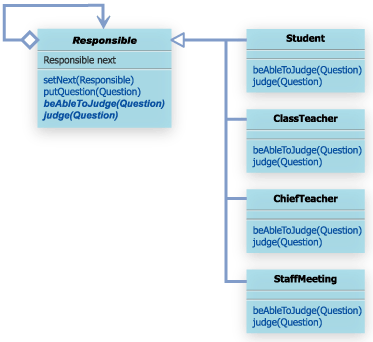

14. Chain of Responsibilityパターン

##14.1 Chain of Responsibilityパターンとは

- 責任の鎖

例えば、何かの決済を「課長」にお願いすると、課長決済で対応出来るものであれば、課長が決済する。

しかし、課長決済で対応出来ないものについては、「部長」に決済をお願いすることになる。
当然、部長が決済できない内容のものであれば、より上位の決済責任者にお願いするかんじになる。

Chain of Responsibilityパターンは、「責任者」を「鎖状」につないでおき、「いずれかの段階」で、「誰か」が処理をすることを表現するようなパターン

##14.2 サンプルケース

- Chain of Responsibilityパターンは、責任の鎖をプログラムで表現するパターン。
- Chain of Responsibilityパターンを利用するたみには、「一般的な責任者を表すクラス」を作成し、それを継承する形で、生徒、学級担任、学年主任、職員会議などのクラスを作成する。
「一般的な責任者を表すクラス」は、判断するメソッドと、自分で判断できなかった場合に判断を仰ぐ、「次の責任者」を表すフィールド変数をもつ。
各責任者を表すクラスは、この「一般的な責任者を表すクラス」を継承して作成する。

[final 修飾子について](http://www.javaroad.jp/java_class12.htm)

##まとめ
一般的なクラス図。
詳しくは当該実装見てください。さよなら。

