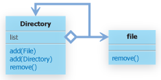
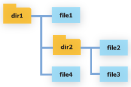
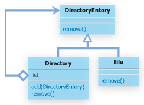
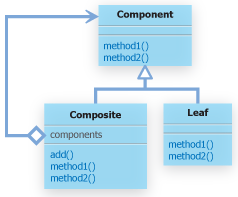

#11. Compositeパターン

##11.1 Compositeパターンとは
- Compositeとは、英語で複合物を意味することば。

Compositeでは、「容器と中身を同一視する」ことで、再帰的な構造の取り扱いを容易にするもの。

「容器と中身を同一視する」必要が生じる例として、ファイルシステムなどがあげられる。

あるフォルダ以下のファイルやフォルダを全て削除したい場合など、それがファイルなのかフォルダなのかを意識せずに、同じように削除できたほうが都合が良いだろう。


##11.2 サンプルケース
サンプルケースでは、ディレクトリとファイルを考える。

まずは、Compositeパターンを意識せずに、ファイルとディレクトリを表すクラスを作成してみよう。

```
package com.bko.structure_patterns.composite;

/**
 * Created by bko on 4/8/15.
 */
public class File {
    private String name = null;
    public File(String name){
        this.name = name;
    }

    public void remove(){
        System.out.println(name + "を削除しました。");
    }

}

```

ディレクトリを表す、Dirctoryクラスは、Listオブジェクトとして、配下のディレクトイrとファイルのオブジェクトを管理し、removeメソッドが呼ばれた場合には、list に保持しているオブジェクトをすべて削除してから、自らを削除するものとする。


```
import java.util.List;
import java.util.ArrayList;
import java.util.Iterator;
 
 
public class Directory{
    private List<Object> list = null;
    private String name = null;
    public Directory(String name){
        this.name = name;
        list = new ArrayList<Object>();
    }
    public void add(File file){
        list.add(file);
    }
    public void add(Directory dir){
        list.add(dir);
    }
    public void remove(){
        Iterator<Object> itr = list.iterator();
        while(itr.hasNext()){
            Object obj = itr.next();
            if(obj instanceof File){
                ((File)obj).remove();
            }else if(obj instanceof Directory){
                ((Directory)obj).remove();
            }else{
                System.out.println("削除できません");
            }
        }
        System.out.println(name + "を削除しました。");
    }
}
```
[ジェネリクスとは](./generics.md)

ディレクトリのremove メソッドが呼ばれると、listに保持しているおbジェクトがfileクラスであるのかdirクラスであるのかチェックして、各クラスにキャストしてからそれぞれのremoveメソッドを呼び出すようにしている。



 上記の２つのファイルを使って、以下のようなファイル構造を記述して、削除してみよう。




```
package com.bko.structure_patterns.composite.test;

import com.bko.structure_patterns.composite.Directory;
import com.bko.structure_patterns.composite.File;

/**
 * Created by bko on 4/8/15.
 */
public class Test1 {
    public static void main(){
        File file1 = new File("file1");
        File file2 = new File("file2");
        File file3 = new File("file3");
        File file4 = new File("file4");
        Directory dir1 = new Directory("dir1");
        dir1.add(file1);
        Directory dir2 = new Directory("dir2");
        dir2.add(file2);
        dir2.add(file3);

        dir1.add(dir2);
        dir1.add(file4);

        dir1.remove();

    }
}
```

実行結果

```
file1を削除しました。
file2を削除しました。
file3を削除しました。
dir2を削除しました
file4を削除しました。
dir1を削除しました

Process finished with exit code 0

```

問題なく動作し、　Compositeパターンなんていらないじゃないかと思ってしまう

ところがここで、ディレクトリには、ディレクトリとファイルだけでなくシンボリックリンクも入るようにしたい

という要求が出てきた

Directoryクラスは、add(Symbolic link)なるメソッドなり、いろいろやんなきゃ

個々で公開する。
なぜCompositeパターンを使わなかったのか！と。。

では、Compositeパターンを利用して上記のファイル構造を記述していくとどうなるか？

COｍぽしてパターンでは、容器の中身と入れ物を同一視する。
同一視するために、容器の中身と入れ物が共通のインタフェイスを実装するようにする。


```
public interface DirectoryEntry{
	public void remove();
}
```

改変版Directory

```
package com.bko.structure_patterns.composite.directory_entries;

import java.util.*;

/**
 * Created by bko on 4/8/15.
 */
public class Directory implements DirectoryEntry {
    private List<DirectoryEntry> list;
    private String name = null;

    public Directory(String name){
        this.name = name;
        this.list = new ArrayList<DirectoryEntry>();
    }

    public void add(DirectoryEntry entry){
        list.add(entry);
    }

    public void remove(){
        Iterator<DirectoryEntry> itr = list.iterator();
        while (itr.hasNext()){
            DirectoryEntry entry = itr.next();
            entry.remove();
        }
        System.out.println(name + "を削除しました");
    }

}

```

改変版File

```
package com.bko.structure_patterns.composite.directory_entries;

/**
 * Created by bko on 4/8/15.
 */
public class File implements DirectoryEntry {
    private String name = null;
    public File(String name){
        this.name = name;
    }

    public void remove(){
        System.out.println(name + "を削除しました。");
    }
}

```

このように、Directoryクラス、Fileクラスを共にDirectoryEntryクラスを実装するクラスとすることで、Directoryクラスのremoveメソッド内では、実態がFileクラスのインスタンスであるのか、Directoryクラスのインスタンスであるのかを木にせず、どちらもDirectoryEntryオブジェクトとして扱うことができるよになる。

まさに、容器と中身を同一視している状態！




さて、このようにCompositeパターンを利用していることで、SymbolicLinkクラスを追加する必要が生じた場合も、柔軟に対応できる。
Direcotryクラスのソースコードを修正する必要ももうない。
ただ、DirectoryEntryインタフェイスを実装するように、SymbolicLinkクラスを実装すればよい。


##11.3 Compositeパターンまとめ

Compositeパターンの一般的なクラス図

