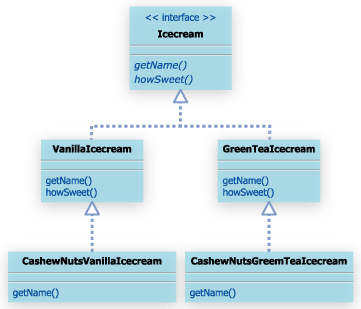
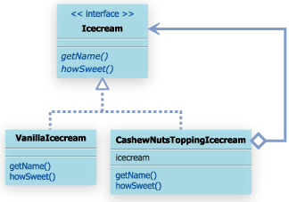
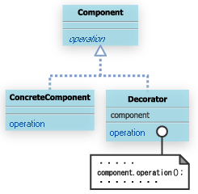

#12. Decoratorパターン

##12.1 Decoratorパターンとは

Decoratorパターンでは、飾り枠と中身を同一視することで、より柔軟な機能拡張方法を提供する。

- Decoratorパターンは機能を一つ一つかぶせていくイメージ。

ある機能を持ったDecorationをコアとなるものにかぶせていくイメージ。

##12.2 サンプルケース

アイスクリーム。

interface IceCream

```
package com.bko.structure_patterns.decorator.ice_creams;

/**
 * Created by bko on 4/8/15.
 */
public interface IceCream {
    public String getName();
    public String howSweet();
}

```

class VanillaIceCream

```
package com.bko.structure_patterns.decorator.ice_creams;

/**
 * Created by bko on 4/8/15.
 */
public class VanillaIceCream implements IceCream {
    @Override
    public String getName() {
        return "バニラアイスクリーム";
    }

    @Override
    public String howSweet() {
        return "バニラ味";
    }
}

```

class GreanTeaIceCream

```
package com.bko.structure_patterns.decorator.ice_creams;

/**
 * Created by bko on 4/8/15.
 */
public class GreanTeaIceCream implements IceCream {
    @Override
    public String getName() {
        return "抹茶アイスクリーム";
    }

    @Override
    public String howSweet() {
        return "抹茶味";
    }
}

```
さて、ここで、これらのアイスクリームインタフェイス実装クラスにトッピングしていくことを考えてみる。

トッピングとしては、カシューナッツ、スライスアーモンドを考えてみる。

カシューナッツがトッピングされたバニラアイスクリームや、スライスアーモンドがトッピングされたバニラアイスクリームが要求される。

これらのトッピングをのせることで、名前(getNameメソッドの返り値)がかわり、あじ(howSwet())の返り値は変わらないものとする。


カシューナッツバニラアイスクリーム

```
public class CashewNutsVanillaIcecream extends VanillaIcecream{
    public String getName(){
        return "カシューナッツバニラアイスクリーム";
    }
}
```

これでもいける。

しかし、このような「継承を利用した機能の追加」は、非常に固定的なものとなってしまう。
例えば、カシューナッツを載せた抹茶アイスクリームを表すインスタンスが欲しい場合には、
抹茶アイスクリーム継承クラスが必要となる。




*Decoratorパターンは、このように様々な機能追加を柔軟に行いたい場合に威力を発揮する。*

Decoratorパターンを利用した設計では、拡張機能部分のみをもたせた別クラスを用意し、そのクラスのインスタンス変数に、
拡張対象となるインスタンスをもたせ、拡張対象と同じインタフェイスを実装させる。

サンプルケースの場合、トッピングとなるカシューナッツを表すクラスを作成する。


カシューナッツトッピングクラス

```
public class CashewNutsToppingIcecream implements Icecream{
    private Icecream ice = null;
    public CashewNutsToppingIcecream(Icecream ice){
        this.ice = ice;
    }
    public String getName(){
        String name = "カシューナッツ";
        name += ice.getName();
        return name;
    }
    public String howSweet(){
        return ice.howSweet();
    }
}
```

クラス図は以下のようになる。
デコレートされる対象のクラスがもってるメソッドと同じメソッドを持ってることが重要で、
メソッドをメソッドでラップしてくかんじ。




このような設計とすることで、以下のように、カシューナッツがトッピングされたバニラアイスクリームも、カシューナッツがトッピングされた抹茶アイスも,

ぜんぶあれしてあれできる。

```

Icecream ice1 = new CashewNutsToppingIcecream(new VanillaIcecream());
Icecream ice2 = new CashewNutsToppingIcecream(new GreenTeaIcecream());
Icecream ice3 = new SliceAlmondToppingIcecream(new CashewNutsToppingIcecream(new VanillaIcecream()));
```

##12.3 Decoratorパターンまとめ

