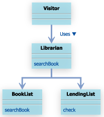

#15. Facadeパターン


##15.1 Facadeパターンとは

プログラムを作っていくと、最小は小さなものでも、だんだん大きなものになっていく。

沢山のクラスができて、相互に関係しあい、複雑になっていく。

クラスを使う場合には、それらの関係を正しく理解して、正しい順番にメソッドを呼び出す必要がある。

大きなプログラムを使って処理を行う場合、関係しあっている沢山のクラスを適切に制御し無くてはならない。

その処理を行うための窓口を用意しておくと、個別に沢山のクラスを制御しなくても、『窓口」に対して、要求するだけですむ。

Facadeパターンは、既存のクラスを複数組み合わせて使う手順を、『窓口」となるクラスを作ってシンプルに利用できるようにするパターン。

- facadeは、フランス語を語源とする単語で、建物の正面。


##15.2 サンプルケース

山田くんは昆虫図鑑を借りるため、図書室へ行きました。 ところがどこにおいてあるのかわかりません。所蔵本リストと、貸出帳がおいてあるのですが、使い方がわからないようです。この状態をソースにするとこんな感じです。

```
//所蔵本リスト
public class BookList {
    public String searchBook(String bookName) {
        String location = null;
        //本の名前から探す
        //あればその場所を、なければnullを返す
        return location;
    }
}
```

```
//貸出帳
public class LendingList {
    public boolean check(String bookName) {
        //貸出帳をチェックする
        //貸出中ならtrue、そうでなければfalseを返す
        return true;
    }
}
```

```
//山田くん
public class Visitor {
    public static void main(String[] args) {
        //昆虫図鑑はどこにあるんだ…？
        //いつどこでどのメソッドを使えばいいんだ？？
    }
}
```




この場合、図書委員の中村くんが、facadeパターンの窓口の役割を果たす。

そのおかげで、山田くんは所蔵本リストや貸出超の使い方をしらんくても、中村くんに聞けば、欲しい本がどこにあるかわかる。


##まとめ
一般的なクラス図


