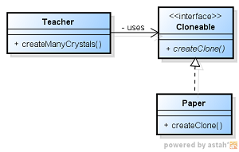

#6. Prototypeパターン

##6.1 Prototypeパターンとは
- Prottypeパターンは、予め用意しておいた「原型」からインスタンスを生成するようにするためのパターン。

- 例えば、「直線を描く」昨日しか持たない図形エディタを想像するとしよう。
- この図形エディタで星形を書きたいときには、直線を組み合わせることで、星の形を作成していくだろう。
	- ではいくつも星型が欲しいときにはどうすればよい？
	- 直線を君合わせて星型を描くという作業を何度も繰り返す必要がでてくる。
- このようなとき、最初に作成した星型を「プロトタイプ」として登録しておき、これをコピーすることで星型が作成できれば、作業がとても楽になる。

*Prototype パターンは、このように、「プロトタイプからインスタンスを生成する」事ができるようにするためのパターン*

##6.2 サンプルケース

教師であるあなたは、クラスの子供達の喜ぶ顔が見たくて、
教室を飾り付けることにした。

飾り付けるのは雪の結晶の形に切り抜かれた紙を100毎とする。

制作にとりかかったが、なかなかうまくいかない。

雪の結晶の形に切り抜かれた紙を作成する方法は以下のとおり。

1. ゆきの結晶の形を紙に綺麗に描く
2. 描いた紙に合わせて紙を切り抜く

class Teacher

```
package com.bko.generate_patterns.proto_type;

/**
 * Created by bko on 4/5/15.
 */
public class Teacher {
    public Paper[] createManyCrystals(){
        Paper[] papers = new Papaer[100];
        for(int n = 0; n < papers.length; n++){
            drawCrystal(papers[n]); //時間がかかる
            cutAccordanceWithLine(papers[n]); //時間がかかる
        }
        return  papers;
    }

    private void drawCrystal(Paper paper){
        //きれいにかくためにじかんがかかる
    }

    private void cutAccordanceWithLine(Paper paper){
        //書かれた線にそって綺麗に切るには時間がかかる
    }
}
```

drawCrystalという時間のかかるメソッドと、cutAccordanceWithLineという時間のかかるメソッドを繰り返し呼ぶ必要があり、とても時間がかかってしまう。
時間をかけずに同じものを沢山作りたい。このようなとき、どうするでしょか？

「最初に作成したものと同じものをつくろう」とおもうですよね
雪の結晶の紙と新しい紙を重ねて、ゆきの結晶の形に合わせて切り抜くことを考える

これは、紙を重ねて切り抜くことにより複製することができるという性質を利用したもの。

プログラム的には、PaperクラスはCloneacleインタフェイスを実装している、と表現することができるだろう。ここで、Cloneableインタフェイスで定義されているのは、返り値がCloneableとなるcreateCloneメソッドであるとする。Paperクラスでは、このcreateCloneメソッドが新しい髪から同じものを作成して返していく。


interface Cloneable

```
package com.bko.generate_patterns.proto_type;

/**
 * Created by bko on 4/5/15.
 */
public interface Cloneable {
    public Cloneable createClone();
}

```

class Paper implements Cloneable

```
package com.bko.generate_patterns.proto_type;

/**
 * Created by bko on 4/5/15.
 */
public class Paper implements Cloneable {
    private String name;
    public Paper(){}

    public Paper(String name){
        this.name = name;
    }

    public void printName(){
        System.out.println(this.name);
    }

    @Override
    public Cloneable createClone() {
        Paper newPaper = new Paper();
        newPaper.name = this.name;

        return newPaper;
    }
}


```

時間のかかる作業は、prototypeを作成する一度だけとなり、時間が節約される。

クラス図




- prototypeパターンは、複製を作成するためのメソッドを用意する、という至って単純なものと考えてよいだろう。

- この特徴をうまく利用すれば、大きなメリットを得ることができる。

例えば、以下の
ようなPrototypeKeeperクラスというものを作成する例をあげてみる。

```

```


