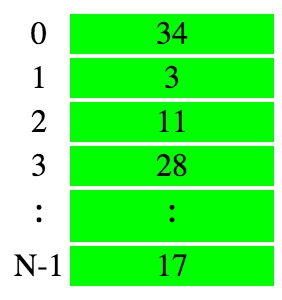
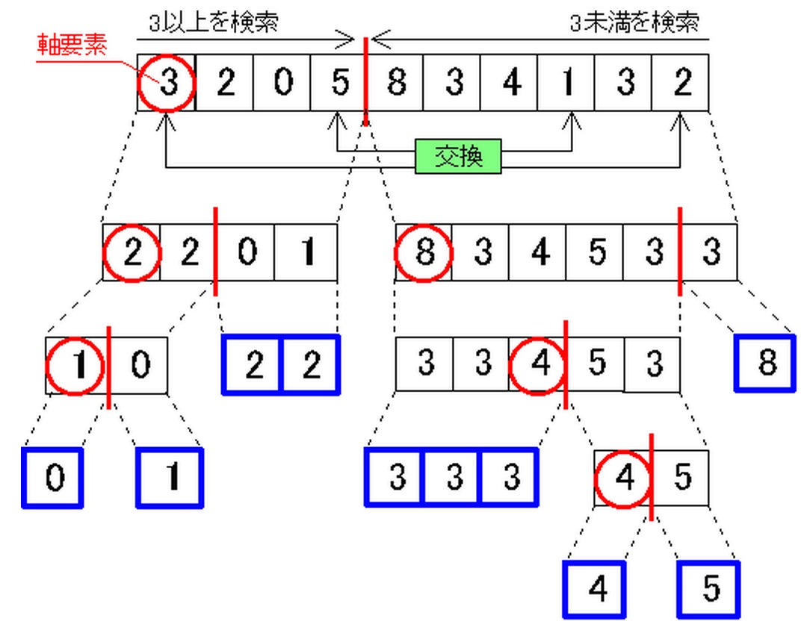

#ソートアルゴリズムについて

##バブルソート
- Nこの数値データが、一個ずつ箱に入って並んでいて、数字はバラバラな順番で格納されているとする。


- バブルソートアルゴリズムの基本方針

***上の要素と比較し、うえのほうが大きければ、互いに交換する***

```

  public void sort(int[] a){

    // 最後の要素を除いて、すべての要素を並べ替えます
    for(int i=0;i<a.length-1;i++){

      // 下から上に順番に比較します
      for(int j=a.length-1;j>i;j--){

	// 上の方が大きいときは互いに入れ替えます
	if(a[j]<a[j-1]){
	  int t=a[j];
	  a[j]=a[j-1];
	  a[j-1]=t;
	}
      }
    }
  }
```


##クイックソート

クイックソートは、データの比較と交換回数が非常に少ないのが特徴で、
一般的なバラバラデータに対して、最も効率欲並べ替えを実行する。
クイックソートは、実用上最も高速であるとされている並べ替えアルゴリズム。

###考え方

バラバラなデータが格納された配列a[]が与えられた場合に、それらをクイックソートで並べ替える手順を、このように示す。



- まずはじめに、「軸要素」と呼ばれるデータ値を決定する
	- この値は、データ全体を２つに分割するときのしきい値として使われる。
	- 軸要素は、分割が均等に行われるように選ぶのが望ましいが、その選択に時間をかけると、かえって並べ替えの時間を大きくしてしまう。
	
- 一般的には、次のような方法がよく用いられる
1. データの先頭の要素を軸要素にする
2. ランダムに一つ選ぶ
3. ランダムに３つ選んで、その中央値を取る
4. 左から見て最初に得られた２つの異なる値の大きい方を取る

- 今回は四番。
- データの先頭から軸要素以上のデータを検索し、データの末尾から軸要素未満のデータを検索し、見つかった場合、それぞれを交換する。
- この作業を検索ラインが交差するまで続けて、交差した場所でデータを２つに分割する。

- 分割されたそれぞれのd−得たに対して同様の処理を繰り返す。
- これを再帰的に繰り返す。


---
#Javaのデータ構造

##配列
	- 配列は複数件のデータを扱うためのデータ構造
	- Javaの配列の特徴は、生成時にサイズ(格納するデータの個数)を決める必要があるということ。一旦配列を生成すると、後から配列のサイズを変更することはできない。
##配列の生成
```データ型[] 配列の名前 = new データ型[配列のサイズ];```
配列の生成では、
- 格納するデータの型
- 配列の名前
- 配列に格納するデータの個数(配列のサイズ)
を指定する。

例えば、10個のStringを格納する配列arrayを生成するには、以下のように書く。

```String[] array = new String[10];```

###配列にデータを格納する
```配列の名前[インデックス] = データ;```

配列へのデータの格納では、
- 配列の名前
- インデックス
- 格納するデータ
を指定する


例えば、配列arrayへのデータの格納は以下のようになる。
配列のサイズは10なので、インデックスは0以上9以下でなければならない。
```
array[0] = "hello";
array[1] = "world";
array[9] = "test";
```
###配列からデータを取得する
```
メソッド( 配列の名前[インデックス] );
変数 = 配列の名前[インデックス];
return 配列の名前[インデックス];
```

##リスト
リストも配列と同幼に、複数件のデータを扱うためのデータ構造
ただし、配列と異なり、リストの生成時にサイズを決める必要はない。
リストにデータを追加する度に、リストのサイズは増えていく。

##リストの生成

```
List<データ型> リストの名前 = new ArrayList<データ型>();
```

###リストにデータの追加

```リストの名前.add(データ);```

###リストからデータの取得

```リストの名前.get(データ);```


##マップ

###マップを生成する
マップとは、キーに関連つけてデータを格納するデータ構造。
マップへのデータの格納時に、キーへの関連付けを行う


```
Map<キーのデータ型, データのデータ型> マップの名前 = new HashMap<キーのデータ型, データのデータ型>();
```

###マップにデータの格納

```
マップの名前.put(キー、データ);
```

###マップからデータの取得

```
メソッド( マップの名前.get( キー ) );
変数 = マップの名前.get( キー );
return マップの名前.get( キー );  
```


###マップ中の全てのデータに同じ処理をする

```
for ( キーのデータ型 key : マップの名前.keySet() ) {
	データのデータ型 data = マップの名前.get( key );
	
	// keyやdataを使った処理;
}
```


---


