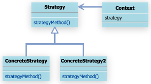

#Strategyパターン
## 10.1 Strategyパターンとは

- Strategyとは英語で戦略
	- 戦略の切り替え、追加が簡単に行えるようになる。
	

普通にプログラミングしていると、メソッドの中に溶け込んだ形でアルゴリズムを実装してしまうことがよくある。
if文などで分岐させることでアルゴリズムを変更するような方法

Strategyパターンは、戦略の部分を意識して別クラスとして作成するようにする。

戦略×部分を別クラスとして作成しておき、戦略を変更したい場合には、利用する戦略クラスを変更する、という方法で対応する。

 Strategyパターンを利用することで、メソッドの中に溶け込んだ形のアルゴリズムより柔軟でメンテナンスしやすい設計となる。
 
 
 ##10.2 サンプルケース
 
 状況に応じてアルゴリズムを変えなkればならないことは多々ある。
 例えばゲームのプログラムでは、何どの設定によって、戦略アルゴリズムを変える必要がある。
 ここでは簡単に、大小の比較を行うアルゴリズムを考える。
 
 まず、人間を表すHumanクラスを作成する。
 
 Humanクラスは、名前、身長、体重、年齢の4つのパラメタを持つものとする。
 
 
 ```
 public class Human{
 
    public String name;
    public int height = -1;
    public int weight = -1;
    public int age = -1;
 
    public Human(String name,int height,int weight,int age){
        this.name = name;
        this.height = height;
        this.weight = weight;
        this.age = age;
    }
}
 ```
 
 
 さてここで、２つのHumanインスタンスが与えられた場合に、それらの大小を比較するSampleClassというクラスを考える。
 
```
public class SampleClass{
    public int compare(Human h1,Human h2){
        if(h1.age > h2.age){
            return 1;
        }else if(h1.age == h2.age){
            return 0;
        }else{
            return -1;
        }
    }
}　
```

ここでは、年齢を比較して、第一引数で渡されたHumanインスタンスの年齢の方が大きければ、１を返し、２つのHumanインスタンスの年齢が同じであれば、０を、以下略

しかし、Humanオブジェクトには複数のパラメタがあり、Humanを比較する方法はたくさん考えられる。

比較結果は、どのパラメータをどのように利用するかにより異なってしまう。
例えば、単純に年齢で比較する場合と、身長で比較する場合では異なる結果になるだろう。


そこで、比較するパラメータを指定できるようなプログラムとすることをかんがえる。

```
public class SampleClass{
    private int type = -1;
    public static final int COMPARE_AGE = 1;
    public static final int COMPARE_HEIGHT = 2;
    public static final int COMPARE_WEIGHT = 3;
    public SampleClass(int compareType){
        this.type = type;
    }
    public int compare(Human h1,Human h2){
        if(type == COMPARE_AGE){
            if(h1.age > h2.age){
                return 1;
            }else if(h1.age == h2.age){
                return 0;
            }else{
                return -1;
            }
        }else if(type == COMPARE_HEIGHT){
            if(h1.height > h2.height){
                return 1;
            }else if(h1.height == h2.height ){
                return 0;
            }else{
                return -1;
            }
        }
        ・・・・・
    }
}　
``` 

メソッドの中に溶け込んだ形でif文の分岐を利用してアルゴリズムを変更するようにすると、超煩雑。ていうか循環的複雑度高すぎ。

[サイクロマティック複雑度](http://ja.wikipedia.org/wiki/循環的複雑度)

Strategyパターンでは、状況に応じて、変更する必要のあるアルゴリズムの部分を、意識的に別クラスとして分離することで、アルゴリズムの修正、追加等の見通しが非常に良くなる。

サンプルケースを例にすると、まずは、比較アルゴリズム部分をクラスとして分離する。
例えば、年齢を比較するための、AgeComparatorクラスを作成する。

```
public class AgeComparator{
    public int compare(Human h1 , Human h2){
        if(h1.age > h2.age){
            return 1;
        }else if(h1.age == h2.age){
            return 0;
        }else{
            return -1;
        }
    }
}
```

比較アルゴリズム部分を分離し、実際の比較処理は、AgeComparatorに委譲できるようにしておく。

```
public class MyClass{
    public int compare(Human h1,Human h2){
        return new AgeComparator().compare(h1,h2);
    }
}
```


これだけでは、しゅっとするだけでメリットはあんまりないし、Strategyパターンにもなっていない。

Strategyパターンでは、分離したアルゴリズム部分が共通のインタフェイスをもつようにすることが求められる。
すなわち、アルゴリズムとして分離された複数のクラスが共通のインタフェイスを保つ必要がある。

サンプルケースでは、年齢を非アクするAgeComparatorクラス以外にも、身長、体重、など考えられる。

これらの比較アルゴリズムをあわら簀クラスに共通のインタフェイスを持たせる。

ここでは、Comparatorインタフェイスを定義してみる。


```
public interface Comparator{
    public int compare(Human h1,Human h2);
}
```

```
public class AgeComparator implements Comparator{
    public int compare(Human h1 , Human h2){
        if(h1.age > h2.age){
            return 1;
        }else if(h1.age == h2.age){
            return 0;
        }else{
            return -1;
        }
    }
}             
```

```
public class HeightComparator implements Comparator{
    public int compare(Human h1,Human h2){
        if(h1.height > h2.height){
            return 1;
        }else if(h1.height == h2.height){
            return 0;
        }else{
            return -1;
        }
    }
}
```


このようにすることで、MyClassはこのように書くことができる。


```
package com.bko.behavior_patterns.strategy;

import com.bko.behavior_patterns.strategy.algorithms.Comparator;

/**
 * Created by bko on 4/7/15.
 */
public class MyClass {
    private Comparator comparator = null;

    public MyClass(Comparator comparator){
        this.comparator = comparator;
    }

    public int compare(Human h1, Human h2){
        return comparator.compare(h1, h2);
    }
}

```


アルゴリズムを追加する際には、同様にComparatorインタフェイスを実装するクラスを追加してやればすむ。

このように、アルゴリズムの部分を別クラスとして作成することで、比較アルゴリズムの追加が簡単になり、メンテの見通しも良くなるんじゃないのー


##10.3　Strategyパターンまとめ

Strategyパターンの一般的なクラス図は以下のようになる。



単なる関数オブジェクト？？
たしかに。


 
 
 
 
 