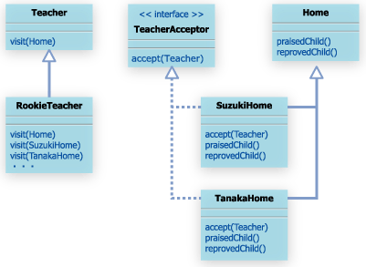
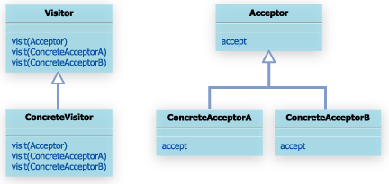

#13. Visitorパターン

##13.1 Visitorパターンとは

Visitorパターンでは、「処理」を訪問者であるVisitorオブジェクトに記述することで、処理の追加を簡単にする。

処理対象となる、Acceptorオブジェクトは、Visitorオブジェクトを受け入れるaccept(Visitor visitor)メソッドを実装している必要がある。

##13.2 サンプルケース

サンプルケースでは、過程訪問を例に考えてみる。

各家庭をAcceptor、先生をVisitorとして、Visitorパターンに当てはめて考えてみる。

新人先生を表すRookieTeacherクラスでは、visitメソッドがオーバーロードされており、訪問する家庭によってvisitメソッドが選択される。

クラス図はいかのようなかんじ

新しい先生が赴任してきた場合も、各家庭はなんら変更しない。

##13.3 Visitorパターンまとめ
一般的なクラス図

