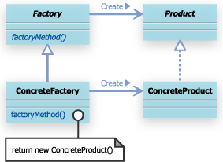

#4.FactoryMethodパターン

##4.1 FactoryMethodパターンとは

- FactoryMethodパターンは、オブジェクトの生成方法に一工夫加えることで、より柔軟にオブジェクトを生成することを目的とするもの。
- FactoryMethodパターンでは、インスタンスの生成をサブクラスに行わせることで、より柔軟に生成するインスタンスを選択することが可能になる。

オブジェクトを生成する場合、下記のようにするのが普通。

```
Product product = new Product();
```

しかし、このようなオブジェクト生成方法では、十分に満足のいく結果が得られないことがある。

そこで、FactoryMethodパターンでは、オブジェクトの生成を担うメソッド(Factory method)を通して間接的にオブジェクトを生成する。


```
public Product factoryMethod(){
	return new Product();
}
```

このこのようなオブジェクト生成方法は、直接new Product()としてオブジェクトを生成する場合に比べ、より柔軟な結果をもたらす。


##4.2 サンプルケース

前回に引き続き、生徒たちに版画クラスを作成させることを目的とする
前回と違うのは、「親クラスでは版材を与えないようにする」という点。
TemplateMethodパターンの親クラスであるWoodCutPrintクラスでは、以下のようにして版材を与えていた。

	private Cuttable hanzai = new Wood();

しかし、いつも人とは違ったことをしたがる今川くんが、「先生、僕は気じゃなくて芋に掘りたい」と言ってきたのです。

ということで、親クラスを変更することにした。

- spec: Cuttableなhanzaiを用意することを条件として、版材にどのようなインスタンスを利用するかは、全て生徒に任せる。

まずは、TemplateMethodパターンを使用したCutPrintクラスを見てみよう
このクラスを利用して、hanzaiの型の決定をサブクラスに任せられるようにすることが目的。

```
public abstract class CutPrint{
 
    protected abstract void draw( Cuttable hanzai );
    protected abstract void cut( Cuttable hanzai );
    protected abstract void print( Cuttable hanzai );
    public void createCutPrint(){
        Wood hanzai = ・・・ //①
        draw( hanzai );
        cut( hanzai );
        print( hanzai );
    }
}
```

①の箇所で、どのクラスのインスタンスが生成されるかは決定したくない。
なぜなら、決めてしまうと、サブクラスで自由に生成するインスタンスの型を決定することができないから。
createCutPrintをサブクラスでオーバーライドすればサブクラスで自由にインスタンスの型を決定することができるが、これではTemplateMethodの利点が失われてしまう。

これを解決する方法として、FactoryMethodパターンがある。
FactoryMethodパターンでは、インスタンス生成のためのメソッドを用意する。
そして、そのインスタンスを生成するためのメソッドを通してインスタンスの生成を行う。

こんなかんじ

```
public abstract class CutPrint{
   
    protected abstract void draw( Cuttable hanzai );
    protected abstract void cut( Cuttable hanzai );
    protected abstract void print( Cuttable hanzai );
    protected Cuttable createCuttable(){
        return new Wood();
    }
    public void createCutPrint(){
        Cuttable hanzai = createCuttable();
        draw( hanzai );
        cut( hanzai );
        print( hanzai );
    }
}
```

このように、インスタンスを生成するメソッドを通してインスタンスを生成するようにしておくことで、サブクラスは、createCuttableメソッドをオーバーライドするメソッドを記述し、版材を自由に選択することがでｋりうようになる。
実際のソースコード

```
public class ImagawasCutPrint extends CutPrint{
    protected void draw(Cuttable hanzai){
         System.out.println("マンガの絵を描く");
    }
    protected void cut(Cuttable hanzai){
         System.out.println("彫刻刀を利用して器用に彫る");
    }
    protected void  print(Cuttable hanzai){
         System.out.println("インクとして、自分の血を使いプリントする");
    }
    protected Cuttable createCuttable(){
        return new Potato();
    }
}
```

##まとめ

*クラス図	*




	
